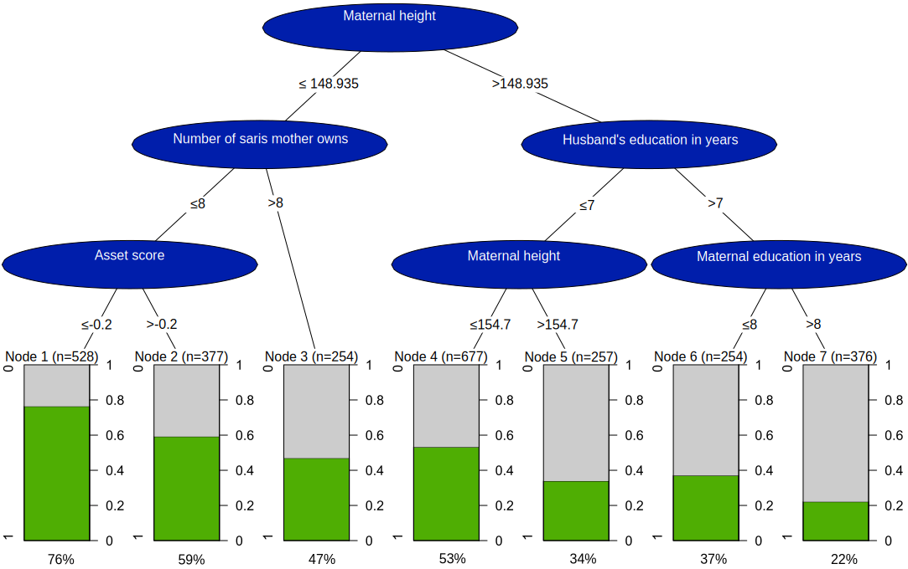

```{r setup, include=FALSE}
knitr::opts_chunk$set(echo = TRUE)
#setwd(dirname(rstudioapi::getActiveDocumentContext()$path)) # set working directory to the root directory of RMD file
# load necessary libraries
library(dplyr) 
library(ggplot2)
library(gridExtra)
library(plotly)
library(shiny)
library(knitr)
```

# Work distribution

Mikael did Assignment 1. Johannes did Assignment 2.8. On the other exercises we did them both individually and then we combined our efforts and chose the most efficient solution for each problem.


# Assignment 1

Sometimes it is necessary to adjust visualizations obtained by complicated R packages and it is difficult to do it programmically. File tree.pdf shows a decision tree created by party package.

### 1.1.

Use Inkscape to produce a publication quality graph.

```{r, out.height=600, out.width="100%", fig.cap = "Figure 1: A tree from assignment 1.", fig.align = "center", include=TRUE}
knitr::include_graphics('tree new fin.pdf')
```


This graph has been improved according to what was supplied in the assignment,

* Terminal nodes has been renumbered
* Node numbers and p-values has been removed from the non-terminal nodes
* Title has been removed
* Percentages has been explicitly added below each terminal node and their position aligned approriately.
* Colors has been adjusted

Colorwise, the graph is easy to interpret with good color contrast between both nodes and their respective text elements, as well as good contrast between the non-terminal and terminal nodes.

\pagebreak

# Assignment 2

Data set SENIC describes the results of measuresments taken at different US hospitals. The description of the variables is given in the accompanying document.

### 2.1

Read data from SENIC.txt into R.

```{r}
data <- read.delim('SENIC.txt', header=FALSE, sep = "") # read the space delimited file into R
var_name = c('ID', 'X1','X2','X3','X4','X5','X6','X7','X8','X9','X10','X11') # column name vector according to SENIC.pdf
colnames(data) = var_name # change column names
data[,c(7,10,11)] <- sapply(data[,c(7,10,11)],as.numeric) # changing the integer columns to numeric


# Text to describe the variables
text<- c('Identification Number',
         'Length of Stay',
         'Age',
         'Infection Risk',
         'Routine Culturing Ratio',
         'Routine Chest X-ray Ratio',
         'Number of Beds' ,
         'Medical School Affiliation' ,
         'Region',
         'Average Daily Census',
         'Number of Nurses',
         'Available Facilities & Services')
```


### 2.2. 

Create a function that for a given column (vector) X that does the following:

a) computes first and third quartiles Q1 and Q3 with quantiles() 
b) Returns indices of outlying observations, i.e. observation X-values greater than Q3+1.5(Q3-Q1) or less than Q1-1.5(Q3-Q1).

```{r}
quantile_func <- function(X){
  
  q1q3 <- quantile(X, c(0.25, 0.75)) # computing the quantiles
  
  # check the condition and pick out the wanted indices
  indices <- which((X > (q1q3[2] + 1.5* (q1q3[2] - q1q3[1]) ))| (X < (q1q3[1] - 1.5* (q1q3[2] - q1q3[1]))))
  
  return((indices)) # returning the indices
}
```


### 2.3.

Use ggplot2 and the function from step 2 to create a density plot of Infection risk in which outliers are plotted as a diamond symbol. Make some analysis of this graph.

```{r, fig.cap = "Figure 2: Density plot of the infection risk with outliers shown as individual points"}
indices <- data.frame('X3'=data[quantile_func(data[,4]),4]) # using the function
indices$Y <- rep(0,nrow(indices))
# creating the plot
plot_3 <-ggplot(data,aes(x=X3))  + geom_density(fill=8,alpha=0.7) + geom_point(data=indices,aes(y=Y),shape=5, size=2) + xlab(text[3])+ ylab('Density') +
  theme_bw() + theme(axis.title.y=element_text(angle=0, vjust=0.5)) # rotating the y-axis
plot_3
```

The distribution for the infection risk looks to be a bit left skewed, the density looks to be highest around 4.5, the Y-axis is rotated so it will be easier to read.

### 2.4.

Produce graphs of the same kind as in step 3 but for all other quantitative variables in data. Put these graphs into one and make some analysis.

```{r,fig.cap= 'Figure 3: Density plots', warning=FALSE,fig.height=8, fig.width=8 }
p_list <- list()
for (i in c(2,3,5,6,7,8,9,10,11,12)){
  var_name <- colnames(data[,2:12]) # Assigning the 
  indice <- data.frame(data[quantile_func(data[,i]),i]) # using the function to collect the outliers
  colnames(indice) <- var_name[i-1]
  indice$Y <- rep(0,nrow(indice))
  # creating the plot and assigningn it to p1,p2 etc...
  p_list[[i-1]] <- ggplot(data,aes_string(x= var_name[i-1] ))  + geom_density(fill=8,alpha=0.7) + 
  geom_point(data=indice,aes(y=Y),shape=5, size=2)+ ylab('Density') + xlab(text[i]) + theme_bw()
}

# printing the list
grid.arrange(grobs = p_list[-3])
```


The distribution vary very much for each variable, some variables are categorical and that's why the distribution may look off. There is a skewness in almost every variable in different directions(left or right), number of beds,average daily census and number of nurse seems to have a high variation for the observations. Note that the x-axis have very different scale for each plot. Here we did not rotate the y-axis as its the same for every graph and it would just take extra space from the interesting information. 

### 2.5.

Create a ggplot2 scatter plot showing the dependence of Infection risk on the Number of Nurses where points are colored by Number of Beds. Is there any interesting information in this plot that was not visible in the plots in step 4? What do you think is a possible danger of having such a color scale?

```{r, fig.cap='Figure 4 :Dependence between infection risk and number of nurses '}
ggplot(data ,aes(x=X10, y=X3, color=X6) ) + geom_point(size = 3) + #creating scatter plot  
  # Changing labs and colors
  xlab("Number of nurses") +ylab("Infection Risk")+ scale_color_continuous(name = "Number of beds", type='viridis') +
  theme_bw() +  theme(axis.title.y=element_text(angle=0, vjust=0.5)) # rotating the y-axis
```

In this plot we can see that there look to be some sort of relationship between the variables infection risk and number off nurses until the number of nurses exceed 3-400. There also seem to be looking like the infection risk doesn't go up when the numbers of nurses go up if the number of beds is high. But this is hard to see as the color scale is continous, we switched the color scheme for it to be a little bit easier but it still doesn't give us enough satisfaction. 


### 2.6.

Convert graph from step 3 to Plotly with ggplotly function. What important new functionality have you obtained compared to the graph from step 3? Make some additional analysis of the new graph.

```{r, fig.cap='Figure 5: Density plot from plotly'}
ggplotly(plot_3) # using plotly
```

You can now hover your mouse over the diamonds to get more information about their x-value.  You can also zoom in and focus on different part of the graph, for e.g. exactly where the density is at it highest, which is close to 4.45.
The graph also looks to be of higher quality as the lines are more smooth.


### 2.7.

Use data plot-pipeline and the pipeline operator to make a histogram of Infection risk in which outliers are pltoted as a diamond symbol. Make this plot in the plotly directly (i.e. without using ggplot2 functionality). 

```{r, fig.cap='Figure 6: Histogram with outliers'}
data %>% plot_ly(x=~X3) %>%  # pipeline that uses the data and column X3
            add_fun(function(plot) {
            plot %>%  slice(quantile_func(X3)) %>% group_by(X3) %>% mutate(Y =n()) %>%  # creating diamonds and slicing out some data for this part of the graph
            add_markers(x=~X3,name="Outliers",y=~Y,marker = list(symbol='diamond',size=9))}) %>% 
            add_histogram(name = "Histogram") %>%  # Adding the histogram with unmanipulated data from the first line
            layout(xaxis=list(title='Infection risk'),
            yaxis = list(title = 'Count'), legend = list(title=list(text='<b> Legend </b>')),bargap=0.1)


```

For the histogram with outliers the Y axis with count is more relevant for the markers than in step 3. Plotly gives you the function to hover over the bars to see the interval and count for each bar. 

### 2.8.

Write a Shiny app that produces the same kind of plot as in step 4 but in addition include:

a) Checkboxes for indicating for which variables density plots should be produced
b) A slider changing the bandwidth parameter in the density estimation

```{r}

ui <- fluidPage( # Slider input 
  sliderInput(inputId="ws", label="Choose bandwidth size", value=0.1, min=0.1, max=1),
  
  # Checkbox input for all variables except X3
  checkboxGroupInput('Variable', 'Variables to choose for graphs',c('X1 - Length of Stay' = 1,
                                                     'X2 - Age' = 2,
                                                     'X4 - Routine Culturing Ratio' = 4,
                                                     'X5 - Routine Chest X-ray Ratio' = 5,
                                                     'X6 - Number of Beds' = 6,
                                                     'X7 - Medical School Affiliation' = 7,
                                                     'X8 - Region' = 8,
                                                     'X9 - Average Daily Census' = 9,
                                                     'X10 - Number of Nurses' = 10,
                                                     'X11 - Available Facilities & Services' = 11)),
  
  plotOutput("densPlot") # output
)

server <- function(input, output,session) {

  output$densPlot <- renderPlot({
    
    p_list <- list()
    for (i in c(2,3,5,6,7,8,9,10,11,12)){
      var_name <- colnames(data[,2:12]) # Assigning the names
      indice <- data.frame(data[quantile_func(data[,i]),i]) # using the function to collect the outliers
      colnames(indice) <- var_name[i-1]
      indice$Y <- rep(0,nrow(indice))
      # creating the plot and assigningn it to p1,p2 etc...
      p_list[[i-1]] <- ggplot(data,aes_string(x= var_name[i-1] ))  + geom_density(bw=input$ws,fill=8,alpha=0.7) + 
        geom_point(data=indice,aes(y=Y),shape=5)+ ylab('Density') + xlab(text[i]) + theme_bw()
    }
    if (length(input$Variable) >=1){ # Controlling that at least 1 box is marked for a graph to be printed
    grid.arrange(grobs = p_list[as.numeric(input$Variable)])}
  })
   
}

# Run the application 
shinyApp(ui = ui, server = server)
```

The bandwidth adjusts how smoothed the plots are and therefore show less or more variation in the plot. For only analyzing the distribution a very high bandwidth is sufficient for most variablse as it shows the overall curvature. However for more deeper analysis of the categorical variables a lower bandwidth can be advantageous as a more detailed graph can give you more insights.


# Appendix
```{r, out.height=600, out.width="100%", fig.align = "center", include=TRUE}
 # assignment 1 tree included incase pdf doesn't load properly
```

```{r ref.label=knitr::all_labels(), echo=TRUE, eval=FALSE}
```