```{r global-options,include=FALSE}
knitr::opts_chunk$set(echo = TRUE, warning = FALSE,message = FALSE, fig.align = 'center')


library(tidytext)
library(dplyr)
library(tidyr)
library(readr)
library(wordcloud)
library(RColorBrewer)
library(visNetwork)
library(ggplot2)
library(plotly)
library(textdata)
library(crosstalk)
library(GGally)
```

# Assignment 1. Text Visualization of Amazon reviews

In this assignment you will analyze feedbacks given by customers for watches Casio AMW320R-1EV bought at www.amazon.com . Files Five.txt and OneTwo.txt contain feedbacks of the customers who were pleased and not pleased with their buy, respectively.


## 1.1 
Visualize word clouds corresponding to Five.txt and OneTwo.txt and make sure that stop words are removed. Which words are mentioned most often?


```{r, fig.cap='Word cloud for five.txt'}

# reading the txt files
text5 <- readLines('Five.txt')

text12 <- readLines('OneTwo.txt')


# Five
text1Frame=tibble(text5=text5)%>%mutate(line = row_number())
pal <- brewer.pal(6,"Dark2")

text1Frame %>% unnest_tokens(word, text5) %>%
  anti_join(stop_words) %>%
  count(word) %>%
  with(wordcloud(word, n, max.words = 100, colors=pal, random.order=F))


```


```{r,fig.cap='Word cloud for onetwo.txt'}
# For text oneTwo
text2Frame=tibble(text12=text12)%>%mutate(line = row_number())


text2Frame %>% unnest_tokens(word, text12) %>%
  anti_join(stop_words) %>%
  count(word) %>%
  with(wordcloud(word, n, max.words = 100, colors=pal, random.order=F))


```

The most common word in the text files is watch as its the biggest word in the cloud, casio, time and price is also more frequent than other words in the five text, in the onetwo text amazon and months are also more frequent. As these texts are costumer feedback for a casio watches its seems logical that these words occur often. 

If you look at the smaller words(green) you could get a sense of that the comments in the onetwo text are more negative than in the five text.


## 1.2 

Without filtering stop words, compute TF-IDF values for OneTwo.txt by aggregating each 10 lines into a separate “document”. Afterwards, compute mean TF-IDF values for each word over all documents and visualize them by the word cloud. Compare the plot with the corresponding plot from step 1. What do you think the reason is behind word “watch” being not emphasized in TF-IDF diagram while it is emphasized in the previous word clouds?

```{r, fig.cap='Word cloud with of the mean TF-IDF-values for each word'}

tidy_frame12=text2Frame%>%unnest_tokens(word, text12)%>%
  mutate(line1=floor(line/10))%>%
  count(line1,word, sort=TRUE)

TFIDF12=tidy_frame12%>%bind_tf_idf(word, line1, n)

TFIDF12  %>% 
  group_by(word) %>% 
  summarise(mean = mean(tf_idf)) %>% 
  with(wordcloud(word, mean, max.words = 100, colors=pal, random.order=F))

```

Watch is not emphasized in these clouds because its occurring in many or all of the "documents" and are therefore not considered as an important word for each document with the formula for TF-IDF . log(N/df(w)) when it occurs in every document is zero.

There is a big difference compared to the plots in task 1, as now we have words that describe a "document" very good instead of the most occurring words.


## 1.3 

Aggregate data in chunks of 5 lines and compute sentiment values (by using “afinn” database) for respective chunks in Five.txt and for OneTwo.txt . Produce plots visualizing aggregated sentiment values versus chunk index and make a comparative analysis between these plots. Does sentiment analysis show a connection of the corresponding documents to the kinds of reviews we expect to see in them?

```{r, fig.cap= 'Sentiment values for five.txt'}
tidy_frame55=text1Frame%>%unnest_tokens(word, text5)%>%
  left_join(get_sentiments("afinn"))%>%
  mutate(line1=floor(line/5))%>%
  group_by(line1, sort=TRUE)%>%
  summarize(Sentiment=sum(value, na.rm = T))

plot_ly(tidy_frame55, x=~line1, y=~Sentiment)%>%add_bars()

```

These "documents" for the five feedback seem to have a positive sentiment as all bars show positive values, these is expected as when you rate something as 5 of 5 then you are satisfied with the product you bought. 


```{r, fig.cap= 'Sentiment values for onetwo.txt'}

tidy_frame121=text2Frame%>%unnest_tokens(word, text12)%>%
  left_join(get_sentiments("afinn"))%>%
  mutate(line1=floor(line/5))%>%
  group_by(line1, sort=TRUE)%>%
  summarize(Sentiment=sum(value, na.rm = T))

plot_ly(tidy_frame121, x=~line1, y=~Sentiment)%>%add_bars()

```

The onetwo customer feedback seem to be negative in the beginning as one bar have a really low value here, then its more neutral / positive as most bars are over 0. This is a bit unexpected as reviews of 1or 2 out of 5 should be customers that are dissatisfied with the product, a more negative tone should be expected in these comments and return more negative values. 

The reason behind the positive values could be that the comments mention some positive things about the watch, maybe how it look and so on, then they might mention something really bad about the watch but it might not be that negative valued by the afinn sentiments.

## 1.4 

Create the phrase nets for Five.Txt and One.Txt with connector words
• am, is, are, was, were
• at
When you find an interesting connection between some words, use Word Trees https://www.jasondavies.com/wordtree/ to understand the context better. Note that this link might not work properly in Microsoft Edge (if you are using Windows 10) so use other browsers.

```{r}

phraseNet =function(text, connectors){
  textFrame=tibble(text=paste(text, collapse=" "))
  tidy_frame3=textFrame%>%unnest_tokens(word, text, token="ngrams", n=3)
  tidy_frame3
  tidy_frame_sep=tidy_frame3%>%separate(word, c("word1", "word2", "word3"), sep=" ")
  
  #SELECT SEPARATION WORDS HERE: now "is"/"are"
  tidy_frame_filtered=tidy_frame_sep%>%
    filter(word2 %in% connectors)%>%
    filter(!word1 %in% stop_words$word)%>%
    filter(!word3 %in% stop_words$word)
  tidy_frame_filtered
  
  edges=tidy_frame_filtered%>%count(word1,word3, sort = T)%>%
    rename(from=word1, to=word3, width=n)%>%
    mutate(arrows="to")
  
  right_words=edges%>%count(word=to, wt=width)
  left_words=edges%>%count(word=from, wt=width)
  
  #Computing node sizes and in/out degrees, colors.
  nodes=left_words%>%full_join(right_words, by="word")%>%
    replace_na(list(n.x=0, n.y=0))%>%
    mutate(n.total=n.x+n.y)%>%
    mutate(n.out=n.x-n.y)%>%
    mutate(id=word, color=brewer.pal(9, "Blues")[cut_interval(n.out,9)],  font.size=40)%>%
    rename(label=word, value=n.total)
  
  #FILTERING edges with no further connections - can be commented
  edges=edges%>%left_join(nodes, c("from"= "id"))%>%
    left_join(nodes, c("to"="id"))%>%
    filter(value.x>1|value.y>1)%>%select(from,to,width,arrows)
  
  nodes=nodes%>%filter(id %in% edges$from |id %in% edges$to )
  
  visNetwork(nodes,edges)
  
}


phraseNet(text5, c('am', 'is', 'are', 'was', 'were'))
phraseNet(text5, c('at'))


```

The size of the words is based on the frequency and a dark color indicates that a word is often located to the left.

We have picked out some interesting connections and used wordtree to see the context, results are shown below.

The wordtrees below have been made on https://www.jasondavies.com/wordtree/.

*Example of the wordtree for the five.txt*
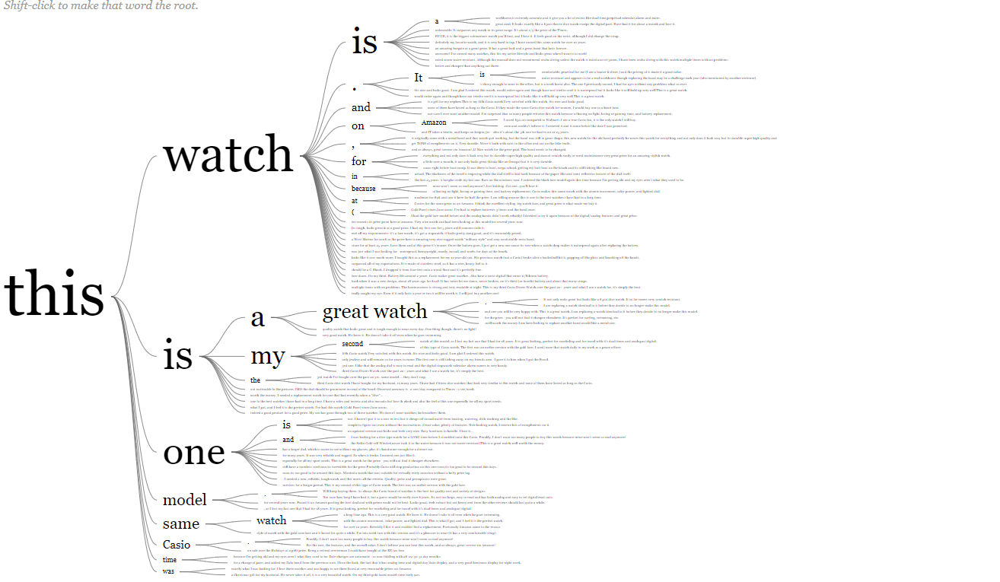

Here we look at interesting sentences.

*Time is 4* 
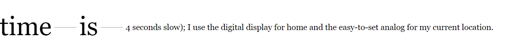
Without looking at the bigger context it's hard to understand that it's a negative comment about how the watch works.


*Time at home?* 

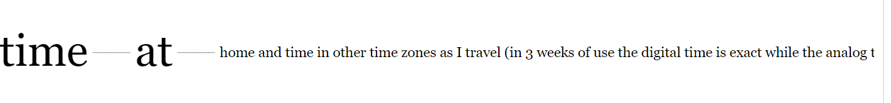

The full sentence is, "of time at home and time in other time zones as I travel (in 3 weeks of use the digital time is exact while the analog time is 4 seconds slow); I use the digital display for home and the easy-to-set analog for my current location."

The sentence "time at home" really doesn't tell you anything unless you look at the whole context.


*watch at waalmart?* 
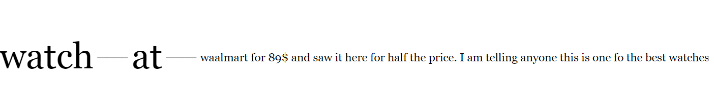
Full sentence is, "watch at waalmart for 89$ and saw it here for half the price. I am telling anyone this is one fo the best watches i have had in a long time."

This was a very positive comment which wasn't clear in the phrase network.


```{r}
phraseNet(text12, c('am', 'is', 'are', 'was', 'were'))
phraseNet(text12, c('at'))
```

*Example of the wordtree for the onetwo.txt*
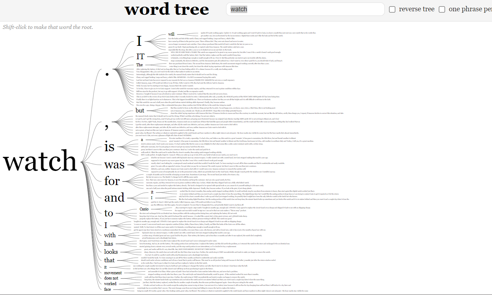


*Terrible at keeping?* 
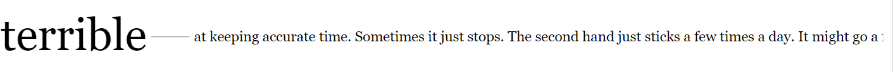
Full sentence: "is terrible at keeping accurate time. Sometimes it just stops. The second hand just sticks a few times a day. It might go a few days without loosing time and then it will stop a few times a day."

This sentence was rather easy to understandd without looking at the context. The word terrible is obviously associated with some bad feature the watch has and therefore it is easy deducted.


*Watch is hot?*
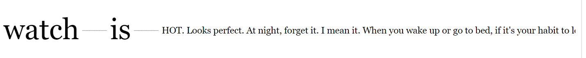
Full sentence: "this watch is HOT. Looks perfect.At night, forget it. I mean it. When you wake up or go to bed, if it's your habit to look at your watch, you won't see it."

This is also rather hard to tell without context. The watch is hot, which could either mean it's very warm or very good looking and context makes it clear it is a positive comment about the looks of the watch. However the user has still given it a negative rating due to the watch not having sufficient functionality.


## 1.5 

Based on the graphs obtained in step 4, comment on the most interesting findings, like:

* Which properties of this watch are mentioned mostly often?

* What are satisfied customers talking about?

* What are unsatisfied customers talking about?

* What are properties of the watch mentioned by both groups?

* Can you understand watch characteristics (like size of display, features of the watches) by observing these graphs?


The properties that are mentioned the most are the alarm, the display and the time keeping, this is for both groups.

Satisfied customers are commenting on the durability of the watch and its materials, the time keeping being good, that the price at amazon are good compared to other places and that its easy to use/understand. 

Unsatisfied customers are commenting on the alarm being bad, the display not working properly and the watch not living up to their expectations. 

You can get an understanding of some of the characteristics of the watch as watch have an arrow to huge on the satisfied customer plot so we guess the watch is kinda big. It should also maybe have some glowing parts on the display as the onetwo text have some complains about this feature. Other than those characteristics there isn't much to say from the two phrase nets. 


# Assignment 2. Interactive analysis of Italian olive oils.
In this assignment, you will continue analyzing data olive.csv that you started working with in lab 2. These data contain information about contents of olive oils coming from different regions in Italy. Each observation contains information about
• Region (1=North, 2=South, 3= Sardinia island)
• Area (different Italian regions)
Different acids:
• Palmitic
• …
• Eicosenoic
ATTN: All diagrams that support your judgments should be included to the report

In this assignment, you are assumed to use Plotly without Shiny.

```{r}
df <- read.csv("olive.csv")
```


## 2.1

Create an interactive scatter plot of the eicosenoic against linoleic. You have probably found a group of observations having unusually low values of eicosenoic. Hover on these observations to find out the exact values of eicosenoic for these observations

```{r, fig.cap='Interactive scatter plot of eicosenoic and linoleic'}

shd <- SharedData$new(df)
# eicosenoic linoleic
sc1 <- plot_ly(shd, x = ~eicosenoic, y = ~linoleic) %>% add_markers(color = I("orange"))%>% 
  layout(xaxis = list(title='Eicosenoic'),yaxis = list(title= 'Linoleic'))
sc1

```


By hovering the observations we can see the observations with distinctly low eicosenoic has a range of values from 1-3.

## 2.2

Link the scatterplot of (eicosenoic, linoleic) to a bar chart showing Region and a slider that allows to filter the data by the values of stearic. Use persistent brushing to identify the regions that correspond unusually low values of eicosenoic. Use the slider and describe what additional relationships in the data can be found by using it. Report which interaction operators were used in this step.

```{r, fig.cap='Linked scatterplot and bar chart'}
b1 <- plot_ly(shd, x = ~Region, y = ~stearic,name=~Region) %>% add_bars(color = I("orange")) %>% 
  layout(barmode = "overlay" )

sub1 <- bscols(widths=c(2, NA),filter_slider("ST", "Stearic", shd, ~stearic)
       ,subplot(sc1, b1, titleX = TRUE)%>%
         highlight(on="plotly_selected", dynamic=T, persistent = T, opacityDim = I(1))%>%hide_legend()%>% 
  layout(xaxis = list(title='Eicosenoic'),yaxis = list(title= 'Linoleic')))
sub1
```

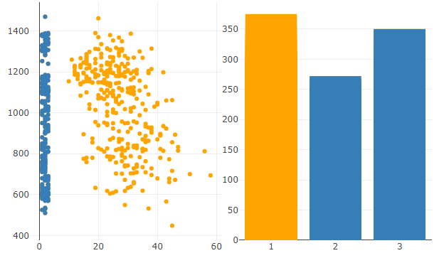

By using a brush to mark the low values of eicosenoic you can easily see that there are solely observations from Region 2 and 3 there, and how they are strictly separated from Region 1 where all other observations are situated in. By filtering the values by stearic, we can see that only Region 1 has values in the 152-168 range where Region 3 starts showing observations, and Region 2 has its lowest value at 199. From 200-270 are where the number of observations largely pick up and all regions share values. However, 272 is the largest observation for Region 2 and after this, Region 1 and 3 their value ranges up until 350 which is the higest point for Region 3, and onwards only Region 1 has observations up to 375. This is interesting that Region 1 clearly has the highest range of values from 152 all the way to 375. This as well as being a strictly separated cluster in the (eicosenoic, linoleic) plot tells us that Region 1 seems to have different characteristics as opposed to the other ones.


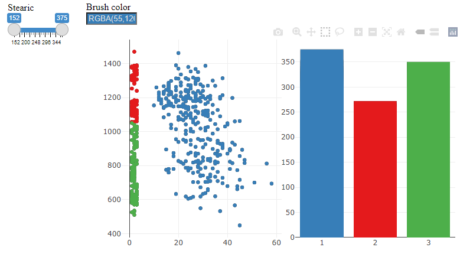

By brushing the bars we can also see that all Region 2 values are high in linoleic compared to Region 3 that  only have linoleic values that are lower compared to it, desipte eicosenoic values being identical. For Region 1 that has great variance in stearic, there seems to be a generally lower value of linoleic the higher value of stearic the region has. However, there are substantially fewer observation points for the higher values than the lower and the two groups are rather mixed and not clearly separated - but still portrays differences. Selection operators are used by the plotly functions in panning, zooming etc. Connection operators are used in that the scatter plot is connected to the bar plot by the stearic variable.
Filtering operators was also used in conjuction with the connection operator, to see how stearic values are related to the linoleic and eicosenoic variables conditioned on regions.

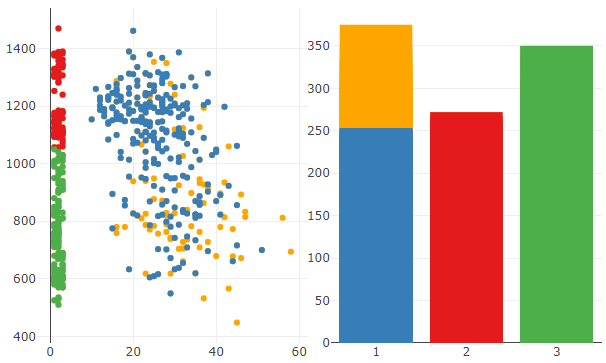

## 2.3

Create linked scatter plots eicosenoic against linoleic and arachidic against linolenic. Which outliers in (arachidic, linolenic) are also outliers in (eicosenoic, linoleic)? Are outliers grouped in some way? Use brushing to demonstrate your findings.

```{r, fig.cap='Linked interactive scatter plot of eicosenoic and linoleic and archidic and linoleic'}
sc2 <- plot_ly(shd, x = ~arachidic, y = ~linoleic) %>% add_markers(color = I("orange"))%>% 
  layout(xaxis = list(title='Arachidic'),yaxis = list(title= 'Linoleic'))

sub2 <- subplot(sc1, sc2, shareY = TRUE, titleX =TRUE) %>% 
  highlight(on="plotly_selected", dynamic=T, persistent=T, opacityDim = I(1))%>%hide_legend()
sub2

```

For (eicosenoic, linoleic) there are several more values where linoleic is equal to or near zero, where for (arachidic, linoleic) they could be considered outliers. This makes their shared outliers rather uncommon. There are basically 2 observations we would consider outliers in both plots, which are; * observation 373 (2,1470), (95, 1470) and * observation 263 (45, 448), (69, 448). These plots have the highest and lowest linoleic values recorded, as well as having among the lowest eicosenoic as well as a high arachidic value. We identified these respective outliers by using a green brush for underlying values, and a purple colored brush for overlying values when brushing the (arachidic, linoleic) plot. This made it pre-attentively easy to simply locate outliers and then hover the colored points in the  (eicosenoic, linoleic) plot to find the outliers that seem to exist in both.
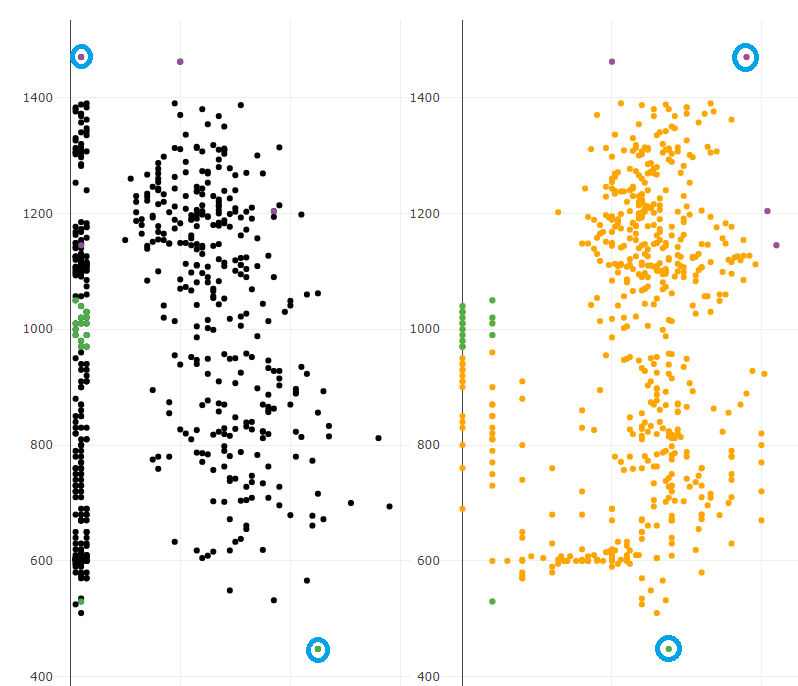


## 2.4 

Create a parallel coordinate plot for the available eight acids, a linked 3d-scatter plot in which variables are selected by three additional drop boxes and a linked bar chart showing Regions. Use persistent brushing to mark each region by a different color.
Observe the parallel coordinate plot and state which three variables (let’s call them influential variables) seem to be mostly reasonable to pick up if one wants to differentiate between the regions. Does the parallel coordinate plot demonstrate that there are clusters among the observations that belong to the same Region? Select the three influential variables in the drop boxes and observe in the 3d-plot whether each Region corresponds to one cluster.


```{r,fig.cap='Relations between multiple graphs and variables'}

#3D-plot and parcoord
d2<-SharedData$new(df)

p<-ggparcoord(df, columns = c(4:11))

d<-plotly_data(ggplotly(p))%>%group_by(.ID)
d1<-SharedData$new(d, ~.ID, group="olive")
p1<-plot_ly(d1, x=~variable, y=~value)%>%
  add_lines(line=list(width=0.3))%>%
  add_markers(marker=list(size=0.3),
              text=~.ID, hoverinfo="text")

df2=df[, c(4:11)]
df2$.ID=1:nrow(df)
d2<-SharedData$new(df2, ~.ID, group="olive")

## Variable selection

ButtonsX=list()
for (i in 4:11){
  ButtonsX[[i-3]]= list(method = "restyle",
                        args = list( "x", list(df[[i]])),
                        label = colnames(df)[i])
}

ButtonsY=list()
for (i in 4:11){
  ButtonsY[[i-3]]= list(method = "restyle",
                        args = list( "y", list(df[[i]])),
                        label = colnames(df)[i])
}

ButtonsZ=list()
for (i in 4:11){
  ButtonsZ[[i-3]]= list(method = "restyle",
                        args = list( "z", list(df[[i]])),
                        label = colnames(df)[i])
}


p3<-plot_ly(d2,x=~palmitic,y=~palmitoleic,z=~stearic)%>%add_markers() %>% 
  layout(updatemenus = list(
    list(y=0.9, buttons = ButtonsX),
    list(y=0.6, buttons = ButtonsY),
    list(y=0.3, buttons = ButtonsZ)
  ),
    scene = list(zaxis = list(title="Z"),
                 yaxis = list(title="Y"),
                 xaxis = list(title = "X")),
         title = "Select variable: ",
  annotations = list(list(text = "<b>X<b>", y = 0.95, x = -0.2, showarrow = FALSE),
                     list(text = "<b>Y<b>", y = 0.62, x = -0.2, showarrow = FALSE),
                     list(text = "<b>Z<b>", y = 0.31, x = -0.2, showarrow = FALSE))
        )

df3 <- df %>% group_by(Region) %>% mutate(count = n())
df3$.ID <- 1:nrow(df)
d3<-SharedData$new(df3, ~.ID, group="olive")
p2 <- plot_ly(d3, x =~Region, y = ~count) %>% add_bars() %>% layout(barmode = "overlay")


bscols(widths = c(7,5,12),p3%>%highlight(on="plotly_click", dynamic=T, persistent = T)%>%hide_legend(), 
         p2 %>% highlight(on="plotly_selected", dynamic=T, persistent = T)%>%hide_legend(),
       p1%>%highlight(on="plotly_selected", dynamic=T, persistent = T, opacityDim = I(1))%>%
         hide_legend())

```

Based on the parallel coordinate plot we have chosen the three variables oleic, eicosenoic and linoleic.  Ranging the magnitudes of oleic, the different regions seem to be well separated. Region 3 has the highest value, followed by region 2 and region 1 the least. The other variable we've chosen is linoleic. Here, Region 3 is clearly separated from Region 2, however, Region 1 are sort of intertwined between them and within their value ranges. For the third variable eicosenoic, Region 1 is clearly well separated from the other two, while Region 1 and Region 2 have almost identical values. In conclusion, this means that one variable separates them well, one separates Region 3 from Region 2 with Region 1 intertwined, and one variable separates Region 1 with Region 2 and 3 intertwined. In general, the plot doesn't show very clustered observations, and for all other variables there is alot of noise in the observed values, in fact those three are the only variable where you can draw some form of conclusion regarding clustering.

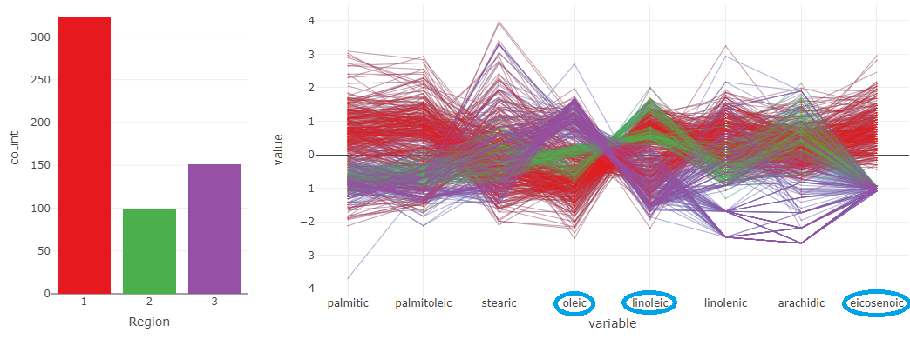
 
However, it is interesting that the three variables together separate the groups in different ways. This is evident in the 3d scatter plot, where the groups show very definitive clusters when plotting those three variables. Region 1 is further away than the other regions and have more variance for the variables, whereas Region 2 and 3 are relatively close to each other albeit well separated and very slight overlapping for a few observations occur.

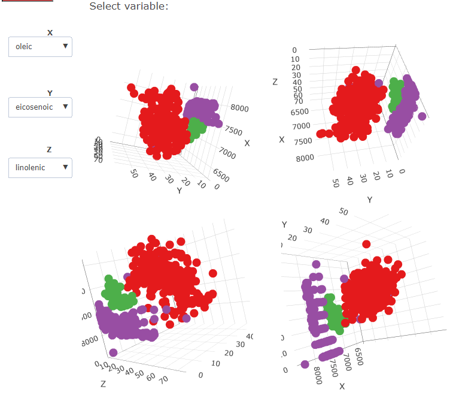

## 2.5

Think about which interaction operators are available in step 4 and what interaction operands they are be applied to. Which additional interaction operators can be added to the visualization in step 4 to make it even more efficient/flexible? Based on the analysis in the previous steps, try to suggest a strategy (or, maybe, several strategies) that would use information about the level of acids to discover which regions different oils comes from.

**==============================================================================================================**

### Operators 


* Reconfiguring, yes, we have sliders so we can switch variables for the 3d scatterplot
We use reconfiguring on the data value space to change the aesthetics mapping. 
 
* Interaction Yes, the plots are interactive 

* Navigation, via the 3d scatterplot
As you can zoom in and out on the plots you are using pixel-wise actions the axis doesn't change, it works on the screen space. 

* Selection operator as we can highlight observations that you find interesting in the plots, this is screen space(highlight parts of the graphs). 

* Connection all the graphs are connected to each other. Together with the selection operator we can use brushing on the graphs. 


* Filter, no, You cant filter the data, we could have added a slider for each variable to filter out observations so clusters could be filtered out.

* Encoding, could add color mapping so that if color blind people can change it.

* Abstraction, we cant figure out any advantages of using abstraction operators on these 3 graphs. 

### Strategy

You could make the method to find clusters more efficient by reordering the variables in the parallel coordinate plot with first computing the distance(maybe try euclidean) then compute the order with and optimization algorithm like Hierarchical clustering that optimizes the Hamiltonian path length. 

As it looks like some acids can separate the regions very well you could do an logistic regression or maybe a tree model to classify where the oils are from with high accuracy. If the models are considered good this will save time to classify each observations instead of finding them in a graph which separates the regions into clusters. 


# Appendix

```{r ref.label=knitr::all_labels(), echo=TRUE, eval=FALSE}
```
